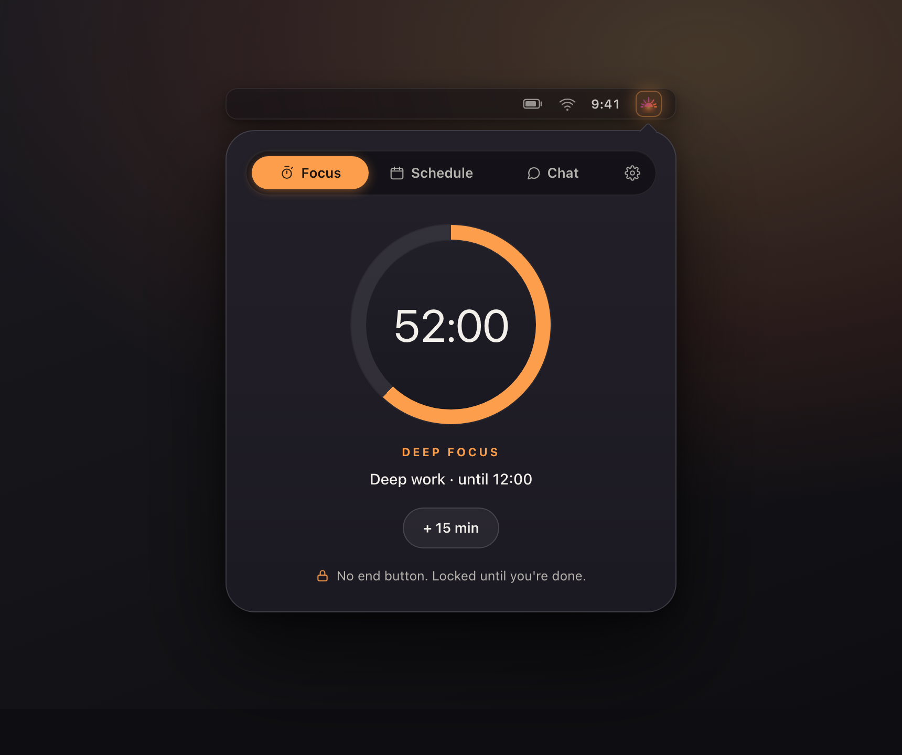

<div align="center">


# Ortus

**A macOS menu-bar focus app that blocks distractions during deep work.**
On a schedule or on demand. No end button until you're done.

[](https://ortus.up.railway.app)
[](https://github.com/scandolo/Ortus/releases/latest)
[](https://ortus.up.railway.app)
[](Package.swift)
[](LICENSE)

[Website](https://ortus.up.railway.app) · [Install](#install) · [How it works](#how-it-works) · [Development](#development)

<br />



</div>

---

## What is Ortus?

Ortus lives in your Mac menu bar and blocks your biggest distraction while you do
deep work. When focus mode starts (manually or on a schedule), Ortus terminates
Slack and keeps it terminated: reopen it and Ortus closes it again. When your
session ends, Slack comes back on its own.

There is no "End Focus" button to talk yourself into. Quitting Ortus mid-session
is blocked too. The only escape hatch is a hidden emergency end, rate-limited to
once per week.

An optional AI chat (powered by your own Claude) lets you check what is happening
in Slack without opening it, so you stay heads-down.

> Willpower runs out. A locked session doesn't. Ortus holds the line so you can
> stay in the work.

## Features

- **Menu bar app** - lives in your menu bar with a sunrise icon, no dock clutter.
- **Real blocking** - kills Slack and prevents relaunch during focus. Not muted, not DND. Gone.
- **Scheduled focus** - set recurring focus hours (for example, weekdays 9:00-12:00).
- **Manual focus** - start a timed session with a slider, from 15 minutes to 4 hours.
- **No end button** - once a session starts, there is no off switch until the time is up.
- **Quit blocking** - Cmd+Q and Dock quit are blocked while focus is active.
- **Emergency end** - hidden in Settings and rate-limited to once per calendar week.
- **AI Slack assistant** - ask your own Claude about your Slack channels without opening Slack.
- **Native and dependency-light** - pure SwiftUI, no Electron, no background account required.

## Install

### One-line install (recommended)

```bash
curl -fsSL https://ortus.up.railway.app/install.sh | bash
```

This downloads the latest release into `/Applications` and launches it. Because it
installs via the terminal (not a browser download), macOS does not quarantine the
app, so Gatekeeper does not block it. Requires macOS 14 or later.

### Download manually

Grab the latest `Ortus-macOS.zip` from the
[Releases page](https://github.com/scandolo/Ortus/releases/latest), unzip it, and
move `Ortus.app` to `/Applications`.

### Build from source

```bash
git clone https://github.com/scandolo/Ortus.git
cd Ortus
./build.sh        # kills running instances, builds, and creates Ortus.app
open Ortus.app
```

Requires macOS 14+ and the Swift 6 toolchain (Xcode).

### AI chat (optional)

To enable the AI Slack assistant, add a Claude API key and connect Slack via OAuth
in **Settings**. Credentials are stored in the macOS Keychain.

## How it works

1. When focus activates, Ortus terminates all Slack processes.
2. It watches for app launches and closes Slack again if it tries to start.
3. An `NSApplicationDelegate` intercepts `Cmd+Q` and termination requests so you
   cannot quit your way out.
4. When focus ends (or the scheduled window passes), monitoring stops and Slack
   relaunches on its own.

## Privacy

Your Slack token and Claude API key are stored in the macOS Keychain and are only
ever sent to Slack and Anthropic respectively. Ortus sends anonymous, aggregate
usage events (via PostHog) to help improve the app. There are no accounts.

## Development

Ortus is a SwiftUI macOS menu-bar app built with Swift Package Manager. It runs as
a `MenuBarExtra` with `.window` style (a popover panel) and no dock icon
(`LSUIElement = true`).

### Project structure

```
Ortus/
├── Package.swift              # SPM config, macOS 14+, single executable target
├── build.sh                   # Build script: kills instances, builds, bundles Ortus.app
├── landing/                   # The marketing site (ortus.up.railway.app), served by Caddy
└── Ortus/
    ├── OrtusApp.swift         # @main entry, MenuBarExtra scene, quit-blocking AppDelegate
    ├── Models/                # ChatMessage, FocusSchedule + ScheduleStore, Slack API types
    ├── Services/
    │   ├── FocusManager.swift # Core logic: focus state, Slack kill/monitor, schedules, emergency end
    │   ├── ClaudeService.swift# Claude API client with an agentic tool-use loop
    │   ├── SlackService.swift # Slack Web API client
    │   ├── SlackOAuthService.swift # OAuth flow via a loopback HTTP server
    │   ├── KeychainService.swift   # macOS Keychain wrapper for secrets
    │   └── Analytics.swift    # Thin PostHog wrapper (anonymous usage events)
    ├── Views/
    │   ├── OrtusTheme.swift   # Design system: sunrise-amber accent, glass materials, tokens
    │   ├── ContentView.swift  # Tab container (Focus, Schedule, Chat, Settings)
    │   ├── FocusView.swift    # Timer, start button, grace period (no end button)
    │   ├── ScheduleView.swift # Recurring schedules with inline editing
    │   ├── ChatView.swift     # AI chat with Claude
    │   └── SettingsView.swift # API keys, Slack OAuth, preferences, emergency end
    └── Tools/
        └── SlackTools.swift   # Tool definitions for Claude's tool-use
```

### Key design decisions

- **No End Focus button.** An easy escape defeats the purpose. Emergency end lives
  in Settings and is gated to once per calendar week. Developer mode (tap the version
  label 7 times) adds a dev-only end button.
- **Inline editing in ScheduleView.** `.sheet()` spawns a new `NSWindow`, which makes
  the `MenuBarExtra` panel lose key-window status and dismiss. Schedules are edited
  in place with state variables instead.
- **Quit blocking via AppDelegate.** `applicationShouldTerminate` returns
  `.terminateCancel` while focus is active, blocking Cmd+Q, Dock quit, and
  programmatic termination.
- **Glass material design.** Cards and the status ring use `.ultraThinMaterial` with
  continuous (supercircle) corner radii, adapting to light and dark mode.

### Dependencies

[PostHog](https://github.com/PostHog/posthog-ios) for anonymous usage analytics.
Everything else is Apple frameworks only (AppKit, Security, Network,
UserNotifications, ServiceManagement).

## License

[MIT](LICENSE). Free and open source.

<div align="center"><sub>Carpe lucem.</sub></div>
