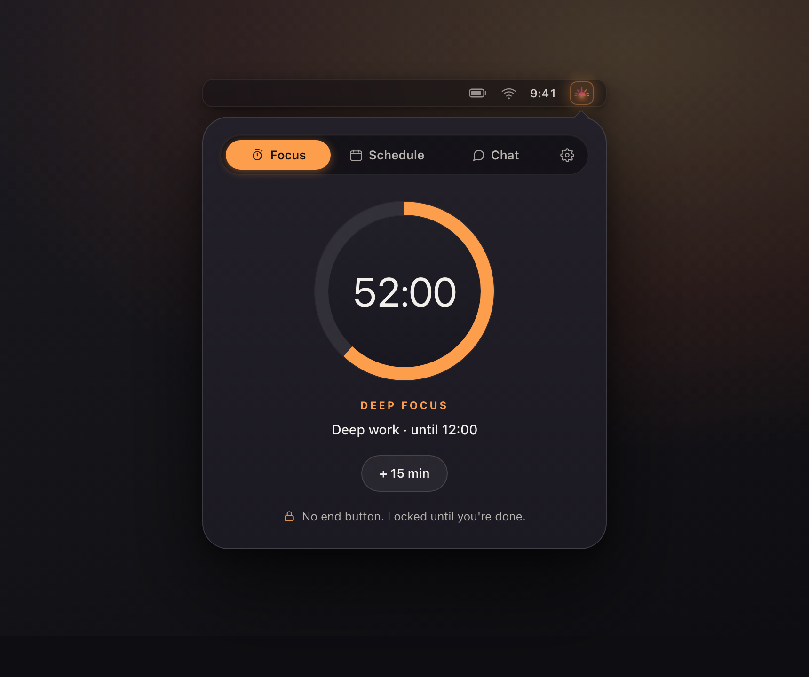

<div align="center">


# Ortus

**The most hardcore focus app for makers.**
A Mac menu-bar app that blocks distractions so you can do deep work.

[](https://ortus.up.railway.app)
[](https://github.com/scandolo/Ortus/releases/latest)
[](https://ortus.up.railway.app)
[](Package.swift)
[](LICENSE)

[Website](https://ortus.up.railway.app) · [Install](#install) · [How it works](#how-it-works) · [Development](#development)

<br />



</div>

---

## What is Ortus?

Ortus lives in your Mac menu bar and blocks your biggest distraction while you do
deep work. When focus mode starts (manually or on a schedule), Ortus terminates
Slack and keeps it terminated: reopen it and Ortus closes it again. When your
session ends, Slack comes back on its own.

There is no "End Focus" button to talk yourself into. Quitting Ortus mid-session
is blocked too. The only escape hatch is a hidden emergency end, rate-limited to
once per week.

An optional AI chat (powered by your own Claude) lets you check what is happening
in Slack without opening it, so you stay heads-down.

> Willpower runs out. A locked session doesn't. Ortus holds the line so you can
> stay in the work.

## Website and app blocking (preview)

This branch adds blocking for websites and Mac apps on top of Slack. It is not in
the public release yet; build it locally:

```bash
./build.sh preview
python3 scripts/install-preview.py
open "/Applications/Ortus Preview.app"
```

**Modes.** A session blocks a mode: **Socials** (the default), **Messages** or
**Everything**. Custom modes are optional: choose **Change → New custom mode** to pick
websites and apps. Websites include their subdomains; Gmail blocks only mail, so
other Google services stay available. Selected apps close when focus starts.

**Browser.** Website blocking uses a small companion extension for Chrome, Arc, Edge
or Brave. In Ortus, open **Settings → Website blocking → Set up** and follow the
three steps (load the `/Applications/Ortus Preview Browser` folder as an unpacked
extension). Repeat for each browser profile; Safari and Firefox are not covered.
Reload the extension once after installing a new build.

**How it fits together.** `Sources/OrtusCore` holds the shared model (targets,
schedules, sessions, browser policy). The app publishes a short-lived policy;
`OrtusBrowserBridge` (a Native Messaging host) passes it to the extension, which
redirects blocked sites to a local page and clears its rules within 20 seconds if
Ortus stops updating them. No browsing data is sent to Ortus.

**Checks**

```bash
swift run OrtusCoreChecks                       # core model
node --test BrowserExtension/tests/*.test.js    # extension logic
bash scripts/test-app-blocking.sh               # app blocking with a fixture app
bash scripts/test-modal-scrolling.sh            # compact and scrollable panel modals
bash scripts/test-brand-glyphs.sh               # website brands and mode marks
python3 scripts/test-browser.py                 # end to end in headless Chromium (needs Playwright)
```

## Install

### One-line install (recommended)

```bash
curl -fsSL https://ortus.up.railway.app/install.sh | bash
```

This downloads the latest release into `/Applications` and launches it. Because it
installs via the terminal (not a browser download), macOS does not quarantine the
app, so Gatekeeper does not block it. Requires macOS 14 or later.

### Download manually

Grab the latest `Ortus-macOS.zip` from the
[Releases page](https://github.com/scandolo/Ortus/releases/latest), unzip it, and
move `Ortus.app` to `/Applications`.

### Build from source

```bash
git clone https://github.com/scandolo/Ortus.git
cd Ortus
./build.sh        # kills running instances, builds, and creates Ortus.app
open Ortus.app
```

Requires macOS 14+ and the Swift 6 toolchain (Xcode).

### AI chat (optional)

To enable the AI Slack assistant, add a Claude API key and connect Slack via OAuth
in **Settings**. Credentials are stored in the macOS Keychain.

## How it works

1. When focus activates, Ortus terminates all Slack processes.
2. It watches for app launches and closes Slack again if it tries to start.
3. An `NSApplicationDelegate` intercepts `Cmd+Q` and termination requests so you
   cannot quit your way out.
4. When focus ends (or the scheduled window passes), monitoring stops and Slack
   relaunches on its own.

## Privacy

Your Slack token and Claude API key are stored in the macOS Keychain and are only
ever sent to Slack and Anthropic respectively. Ortus sends anonymous, aggregate
usage events (via PostHog) to help improve the app. There are no accounts.

## Development

Ortus is a SwiftUI macOS menu-bar app built with Swift Package Manager. It runs as
a `MenuBarExtra` with `.window` style (a popover panel) and no dock icon
(`LSUIElement = true`).

### Project structure

```
Ortus/
├── Package.swift              # SPM config, macOS 14+: app, OrtusCore, bridge, core checks
├── build.sh                   # Builds and bundles Ortus.app (debug, release, preview)
├── landing/                   # The marketing site (ortus.up.railway.app), served by Caddy
├── BrowserExtension/          # Chromium companion: blocking rules, blocked page, popup
├── Sources/
│   ├── OrtusCore/             # Shared model: targets, modes, schedules, sessions, browser policy
│   └── OrtusBrowserBridge/    # Native Messaging host between the app and the extension
├── Tests/OrtusCoreTests/      # Core checks (run with Command Line Tools only)
├── scripts/                   # Preview installer and app/browser integration tests
└── Ortus/
    ├── OrtusApp.swift         # @main entry, MenuBarExtra scene, quit-blocking AppDelegate
    ├── Models/                # ChatMessage, emoji catalog, Slack API types
    ├── Services/
    │   ├── FocusManager.swift # Sessions, modes, schedules, emergency end
    │   ├── ApplicationBlocker.swift    # Closes and watches blocked Mac apps
    │   ├── WebsiteBlockingService.swift# Publishes the browser policy, browser setup
    │   ├── ClaudeCodeService.swift     # Chat via the local Claude Code CLI
    │   ├── SlackService.swift # Slack Web API client
    │   ├── SlackOAuthService.swift # OAuth flow via a loopback HTTP server
    │   ├── KeychainService.swift   # macOS Keychain wrapper for secrets
    │   ├── UpdateService.swift     # Release updates
    │   └── Analytics.swift    # Thin PostHog wrapper (anonymous usage events)
    ├── Views/
    │   ├── OrtusTheme.swift   # Design tokens and button styles (shared with extension/landing)
    │   ├── OrtusComponents.swift   # Rows, groups, modals, pressable style, flow layout
    │   ├── BrandGlyph.swift   # Monochrome site marks and the floating mode cluster
    │   ├── ContentView.swift  # Tab container (Focus, Schedule, Chat, Settings) and modals
    │   ├── FocusView.swift    # Timer, duration and mode card, grace period
    │   ├── OrtusDurationSlider.swift   # The sunrise duration slider
    │   ├── BlockingTargetsEditor.swift # Mode picker, mode builder, browser setup
    │   ├── ScheduleView.swift # Recurring schedules with inline editing
    │   ├── ChatView.swift     # Chat with Claude Code
    │   └── SettingsView.swift # Connections, Slack status, general, Slack setup
    └── Debug/
        └── SnapshotHarness.swift   # Debug-only offscreen renders of every panel state
```

### Key design decisions

- **No End Focus button.** An easy escape defeats the purpose. Emergency end lives
  in Settings and is gated to once per calendar week. Developer mode (tap the version
  label 7 times) adds a dev-only end button.
- **Inline editing in ScheduleView.** `.sheet()` spawns a new `NSWindow`, which makes
  the `MenuBarExtra` panel lose key-window status and dismiss. Schedules are edited
  in place with state variables instead.
- **Quit blocking via AppDelegate.** `applicationShouldTerminate` returns
  `.terminateCancel` while focus is active, blocking Cmd+Q, Dock quit, and
  programmatic termination.
- **Glass material design.** Cards and the status ring use `.ultraThinMaterial` with
  continuous (supercircle) corner radii, adapting to light and dark mode.

### Dependencies

[PostHog](https://github.com/PostHog/posthog-ios) for anonymous usage analytics.
Everything else is Apple frameworks only (AppKit, Security, Network,
UserNotifications, ServiceManagement).

## License

[MIT](LICENSE). Free and open source.

<div align="center"><sub>Carpe lucem.</sub></div>
